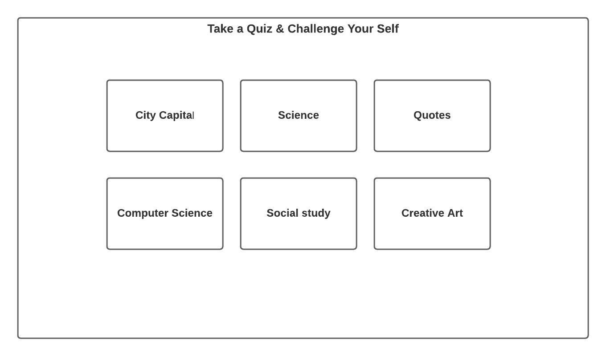
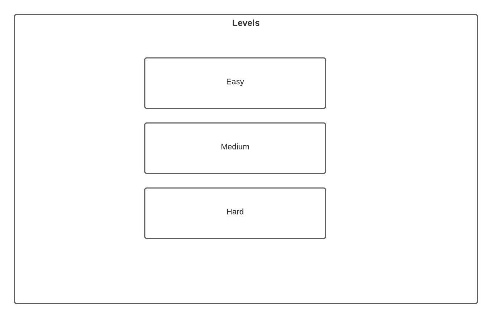
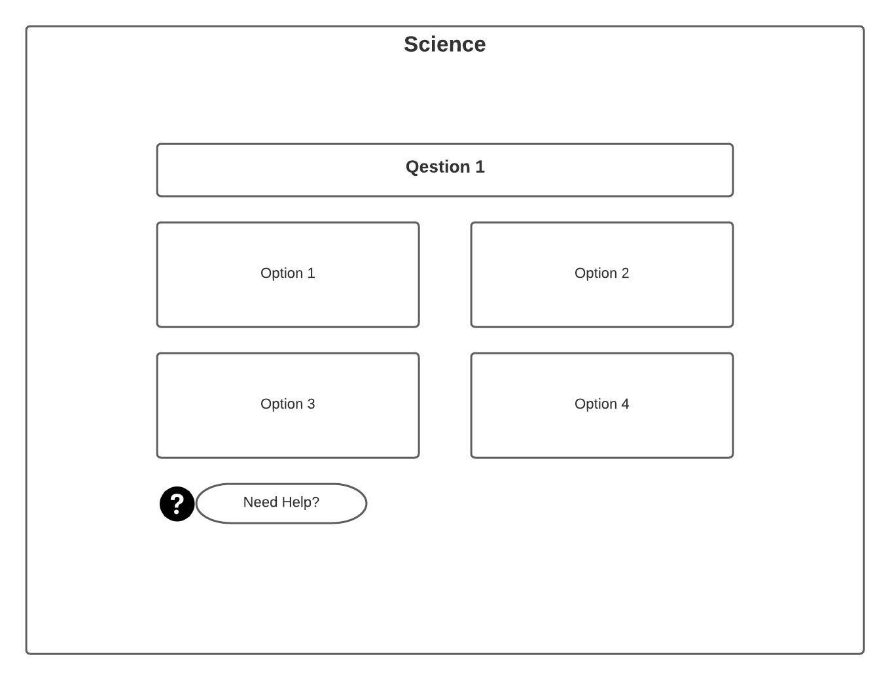
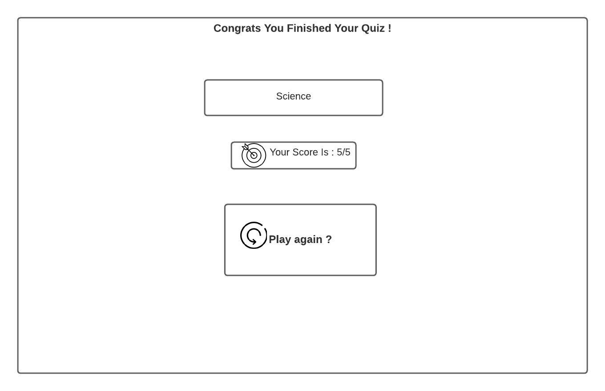
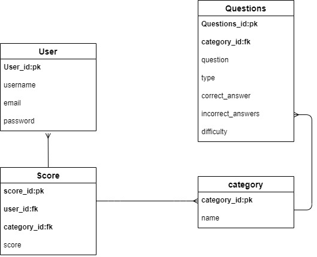

## A Quiz Website
Quiz website allows the user to select their favorite category to take quick quiz in. 
The user is able to select the level of the quiz and see his results.
The admin is able to add new Quiz Category with the levels, Update it and delete Quiz.
<br>

## Getting Started
To run this project on your local machine, fork and clone the repo from github. <br>
Create Database by running this command 
```
createdb -U postgres Quiz
```
in the project directory terminal.<br>
And this command After Creating the DB
```
python3 manage.py makemigrations
``` 
and 
```
python3 manage.py migrate
```
Run 
```
python manage.py runserver
```
to start your server.<br>
<br><br>


## User Stories 
-The user should be able to sign up. <br>
-The user should be able to login. <br>
-The user should be able to reset the password.<br>
-The user should be able to select the category of the quiz.<br>
-The user should be able to select the level of the quiz.<br>
-The user should be able to see the result of the quiz.<br>
-The user should be able to see the top 5 competitors.<br>
-The admin should be able to do add a new Quiz.<br>
-The admin should be able to update the Quiz.<br>
-The admin should be able to delete the Quiz.<br>


## WireFrames
| Category page      | Levels page      | Questions Page      | Result Page      | Top Five page      
|------------|-------------|------------|-------------|------------
| | |  |  | 

## ERD 
| ERD        
|------------|
| | 


## Folder Structure 
```
├── Quiz
│   ├── main_app
│   |   ├── __pycache__
│   |   ├── migrations
|   |   ├── templates
|   |   |   ├── main_app  
│   |   │       ├── forms.py
│   |   │       ├── questions_confirm_delete.html
│   |   │       ├── questions_form.html
│   |   │       ├── questions_show.html
│   |   │       ├── questions_update.html
│   |   │       ├── quiz_confirm_delete.html
│   |   │       ├── quiz_form.html           
|   |   │   ├── quiz    
│   |   │       ├── index.html
│   |   │       ├── show.html          
|   |   │   ├── base.html             
|   |   │   ├── category_top_five.html           
|   |   │   |── index.html
|   |   |   ├── levels.html            
|   |   │   ├── login.html             
|   |   │   ├── password_reset_complete.html             
|   |   │   ├── password_reset_confirm.html    
|   |   │   ├── password_reset_done.html   
|   |   │   |── password_reset_email.html
|   |   |   ├── password_reset_form.html           
|   |   │   ├── profile.html           
|   |   │   ├── Questions.html             
|   |   │   ├── Result.html      
|   |   │   ├── signup.html  
|   |   │   ├── test.html 
|   |   │   ├── top.html   
|   |   │   └── welcome.html
│   |   ├── models.py
│   |   ├── urls.py
│   |   └── views.py
|   ├── static
│   ├ └── style.css
|   ├── manage.py
├── env
├── .gitignore
└── README.md
```
## Use
Either download the project or [Use it online](https://brain-quizy.herokuapp.com/)
<br><br><br>

## Technologies Used :
- HTML.
- CSS.
- Django. 
- Python. 
- Bootstrap.
- Postgres.
- AJAX.

<br>

## API :
[Api Link](https://opentdb.com/api_config.php)

## Run Requirement:
All application components are usable across modern desktop, tablet and phone browsers.
<br>


## Future Features: 
- [ ] Add a Timer to the Quiz. 
- [x] Add win streak bonus. 
 
## Team Members:
[Faisal Alsagri](https://git.generalassemb.ly/faisalabdulaziz)\
[Dhuha Ahmad](https://git.generalassemb.ly/dhuhaahmad)\
[Ola Altalhi](https://git.generalassemb.ly/olaaltalhi)\
[Shaima Alshammary](https://git.generalassemb.ly/shaimacs)

## Special thanks:
Many many thanks to: JRJS\
[Mohammad Jouza](https://git.generalassemb.ly/MohammadJouza)\
[Raymond](https://git.generalassemb.ly/raymond)\
[Jaber alsalamah](https://git.generalassemb.ly/jaberalsalamah)\
[Sameh kinawy](https://git.generalassemb.ly/samehkinawy)\
[Sara Kuddah]


## Resourses 
- [Stackoverflow](https://stackoverflow.com/).
- [Django Documenations](https://docs.djangoproject.com/en/3.1/).
- [Bootstrap](https://getbootstrap.com/).
- [W3School](w3schools.com/).